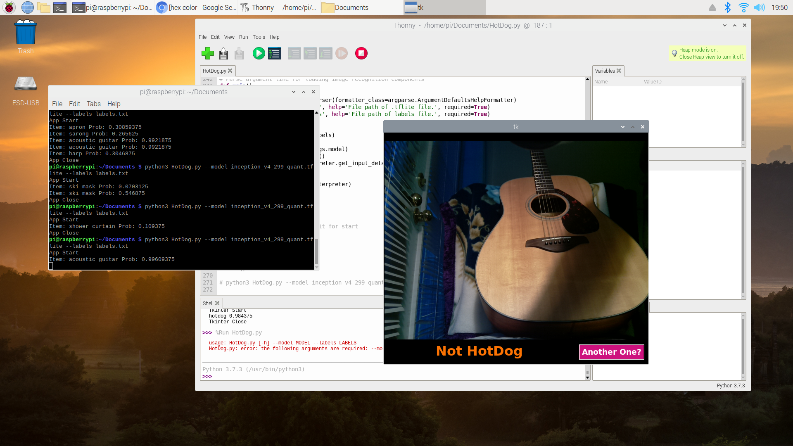

# HotDog
Hotdog identification app based of HBO’s Silicon Valley on Raspberry Pi 

Build using python3
Requires a tflite model that can identify hotdog such as Inception_v4_quant from TensorFlow. Link at https://tfhub.dev/tensorflow/lite-model/inception_v4_quant/1/default/1. The label file is provided in the repository.   
The model and label should be in the same directory such that command line can pass the files into the program. 

To activate the app, please pass in the model and label name like  
python3 HotDog.py --model /*tflitemodelname*/ --labels /*labeltextname*/  
python3 HotDog.py --model inception_v4_299_quant.tflite --labels labels.txt
